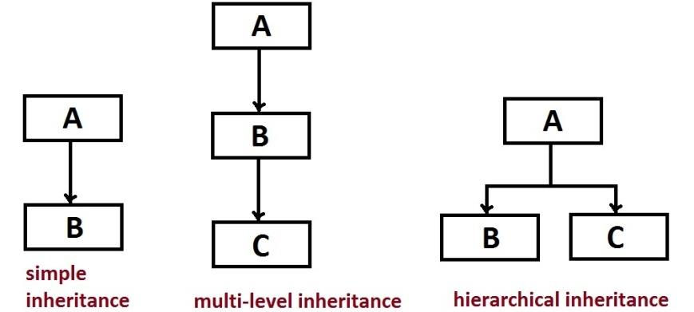

# Object Oriented Programming

* Incapsulation
* Inheritance
* Polymorphism

* Principles
    * abstraction
    * composition
    * aggregation
    * assotiation
    * multilevel inheritance

## Inheritance

Different Types of Inheritance:
* Single inheritance.
* Multi-level inheritance.
* Multiple inheritance.
* Multipath inheritance.
* Hierarchical Inheritance.
* Hybrid Inheritance.

## Abstract Classes

An abstract class can be considered as a blueprint for other classes. It allows you to create a set of methods that must be created within any child classes built from the abstract class. A class which contains one or more abstract methods is called an abstract class. An abstract method is a method that has a declaration but does not have an implementation. While we are designing large functional units we use an abstract class. When we want to provide a common interface for different implementations of a component, we use an abstract class.

**Why use Abstract Base Classes:**

By defining an abstract base class, you can define a common Application Program Interface(API) for a set of subclasses. This capability is especially useful in situations where a third-party is going to provide implementations, such as with plugins, but can also help you when working in a large team or with a large code-base where keeping all classes in your mind is difficult or not possible.

## Multilevel inheritance

**Multilevel inheritance** refers to a mechanism in OO technology where one can inherit from a derived class, thereby making this derived class the base class for the new class. As you can see in below flow diagram C is subclass or child class of B and B is a child class of A.

