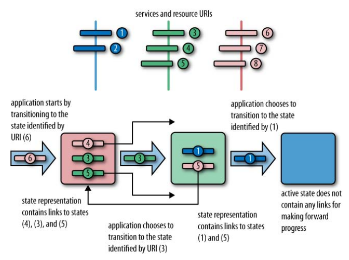
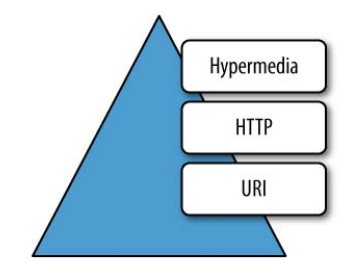

# REST

REST - REpresentational State Transfer

## Resources

Resources are the fundamental building blocks of web-based systems, to the extent that **the Web is often referred to as being “resource-oriented.”** A resource is anything we expose to the Web from a document, video clip to a business process or device.

From a consumer’s point of view, a resource is anything with which that consumer interacts while progressing toward some goal.

Many real-world resources are a result of our abstracting out their useful _information aspects_ and presenting these aspects to the digital world.

### Resource identifiers

To use a resource we need both to be able to identify it on the network and to have
some means of manipulating it. **The Web provides the Uniform Resource Identifier, or
URI**, for just these purposes.

* A URI uniquely identifies a web resource, and at the same time makes it addressable, or capable of being manipulated using an application protocol such as HTTP
* A resource’s URI distinguishes it from any other resource, and it’s through its URI that interactions with that resource take place.

> The relationship between URIs and resources is many-to-one

#### Terms used on the Web to refer to identifiers

|Term| Comments|
|------|-----|
|URI (Uniform Resource Identifier)| This is often incorrectly referred to as a “Universal” or “Unique” Resource Identifier; “Uniform” is the correct expansion.|
|IRI (International Resource Identifier)| This is an update to the definition of URI to allow the use of international characters.|
|URN (Uniform Resource Name)| This is a URI with “urn” as the scheme, used to convey unique names in a particular “namespace.” The namespace is defined as part of the URN’s structure. For example, a book’s ISBN can be captured as a unique name: *urn:isbn:0131401602*.|
|URL (Uniform Resource Locator)| This is a URI used to convey information about the way in which one interacts with the identified resource. For example, <http://google.com> identifies a resource on the Web with which communication is possible through HTTP. This term is now obsolete, since not all URIs need to convey interaction-protocol-specific information. However, the term is part of the Web’s history and is still widely in use.|
|Address| Many think of resources as having “addresses” on the Web and, as a result, refer to their identifiers as such.|

#### URI Versus URL Versus URN

> URLs and URNs are special forms of URIs. A URI that identifies the mechanism by which a
resource may be accessed is usually referred to as a URL. HTTP URIs are examples of URLs.
>
>If the URI has urn as its scheme and adheres to the requirements of RFC 2141 and RFC
2611, it is a URN. The goal of URNs is to provide globally unique names for resources.

### Resource Representations

Resources must have at least one identifier to be addressable on the Web, and each identifier is associated with one or more *representations*. A representation is transformation or a view of a resource’s state at an instant in time. This view is encoded in one or more transferable formats, such as XHTML, Atom, XML, JSON, plain text comma-separated values, MP3, or JPEG.

That is, web components **exchange representations** - they never access the underlying resource directly.

Each representation is a view onto the same underlying resource, with transfer for-
mats negotiated at runtime through the Web’s **content negotiation** mechanism.
Using content negotiation, consumers can negotiate for specific representation formats from a service. They do so by populating the *HTTP Accept request header* with a list of media types they’re prepared to process

## Communication

A collection of *verbs* (*methods* by HTTP specification) is used for communication between systems.

GET , POST , PUT , DELETE , OPTIONS , HEAD , TRACE , CONNECT , and PATCH

In addition to verbs, HTTP also defines a collection of response codes, such as 200 OK, 201 Created, and 404 Not Found, that coordinate the interactions instigated by the use of the verbs.

Taken together, verbs and status codes provide a general framework for operating on resources over the network.

## Hypermedia

The architectural abstractions and constraints Roy Fielding established led to the introduction of *hypermedia as the engine of application state*.

A distributed application makes forward progress by transitioning from one state to another, just like a state machine. The difference from traditional state machines, however, is that the possible states and the transitions between them are not known in advance. Instead, as the application reaches a new state, the next possible transitions are discovered.

In a hypermedia system, application states are communicated through representations of uniquely identifiable resources. The identifiers of the states to which the application can transition are embedded in the representation of the current state in the form of links. Figure below illustrates such a hypermedia state machine.

This, in simple terms, is what the famous **hypermedia as the engine of application state or HATEOAS** constraint is all about. We see it in action every day on the Web, when we
follow the links to other pages within our browsers.

For better understanding of the Web as application platform read - [Web](/pages/architecture/web).

## Richardson Maturity Model

Leonard Richardson proposed a classification for services on the Web that is used to quantify discussions on service maturity. Leonard’s model promotes three levels of service maturity based on a service’s support for URIs, HTTP, and hypermedia (and a fourth level where no support is present).

The diagram below shows the three core technologies with which Richardson evaluates service maturity. Each layer builds on the concepts and technologies of the layers below. Generally speaking, the higher up the stack an application sits, and the more it employs instances of the technology in each layer, the more mature it is.

* **Level Zero Services** -_Services that have a single URI, and which use a single HTTP method (typically POST)_.
  * For example, most Web Services (WS-*)-based services use a single URI to identify an endpoint, and HTTP POST to transfer SOAP-based payloads, effectively ignoring the rest of the HTTP verbs
  * XML-RPC and Plain Old XML (POX) employ similar methods: HTTP POST requests with XML payloads transmitted to a single URI endpoint, with replies delivered in XML as part of the HTTP response
  * We can say that services tunnel all interactions through a single (large, complex) resource
* **Level One Services** - _The next level of service maturity employs many URIs but only a single HTTP verb_
  * The key dividing feature between these kinds of rudimentary services and level zero services is that level one services expose numerous logical resources, while level zero services tunnel all interactions through a single (large, complex) resource. In level one services, however, operations are tunneled by inserting operation names and parameters into a URI, and then transmitting that URI to a remote service, typically via HTTP GET.
* **Level Two Services**
  * Level two services host numerous URI-addressable resources. Such services support several of the HTTP verbs on each exposed resource. Included in this level are Create Read Update Delete (CRUD) services, which we cover in Chapter 4, where the state of resources, typically representing business entities, can be manipulated over the network.
  * Importantly, level two services use HTTP verbs and status codes to coordinate interactions. This suggests that they make use of the Web for robustness.
* **Level Three Services**
  * The most web-aware level of service supports the notion of hypermedia as the engine of application state. That is, representations contain URI links to other resources that might be of interest to consumers. The service leads consumers through a trail of resources, causing application state transitions as a result.

  [Richardson Maturity Model](https://martinfowler.com/articles/richardsonMaturityModel.html) by Martin Fowler

## Links

* [REST in Practice: Hypermedia and Systems Architecture](http://shop.oreilly.com/product/9780596805838.do)