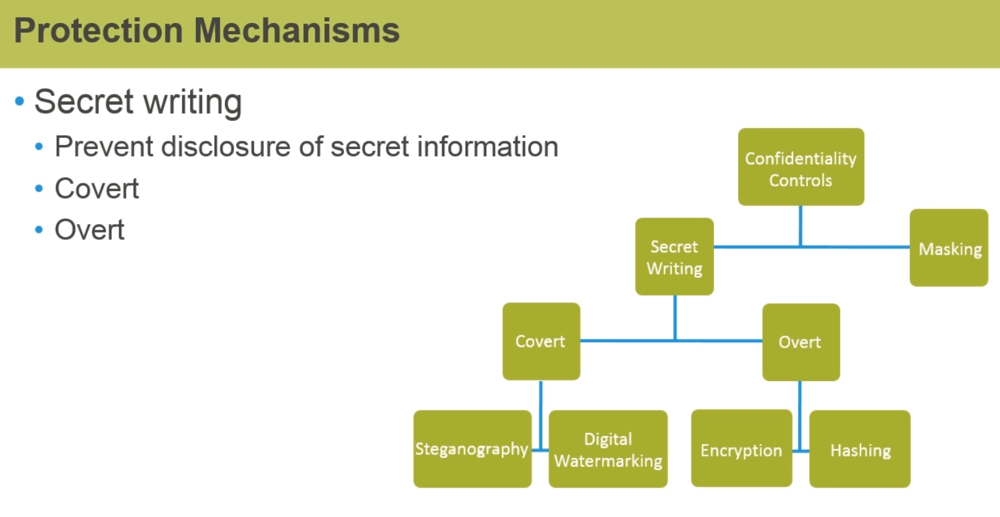

# Security guidelines

## Security core concepts

### Confidentiality

Data classification: Public, Non-public

### Integrity

Validation to ensure integrity:
* Parity Bit
* Cyclic Redundancy Checking (CRC) = checksum
* Hashing
* Digital fingerprint

### Availability

Recovery Time Objective (RTO)

### Authentication and Authorization

Authentication types:
* Anonymous (public access)
* Basic
* Digest
* Integrated (Windows) - challenge/response
* Client certificates
* Forms
* Token-Based Authentication - used in conjunction with username and passwords
* Smart Cards
* Biometrics

Authorization:
* Discretionary Access Control (DAC)
    * Restrict access to objects
    * Identity based access control
    * Role based access control
    * Access control lists (ACL)
* Nondiscretionary AC (NDAC)
* Mandatory Access Control (MAC)
* Role Based Access Control (RBAC)

Accounting (Audit logs)

## Security design principles

## Links

* [Password Storage Cheat Sheet](https://www.owasp.org/index.php/Password_Storage_Cheat_Sheet)
* [How To Safely Store A Password](https://codahale.com/how-to-safely-store-a-password/)