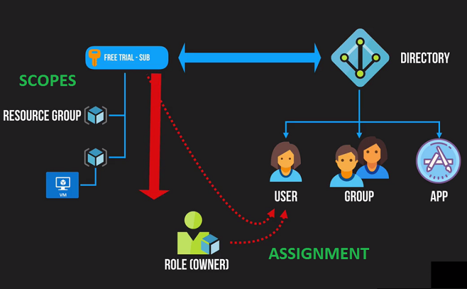

# Azure cloud

* Azure - Public Cloud
* Azure Stack - Private Cloud

Azure versions (co-existence):

* Azure v1 - Azure Service Management (ASM), Classic portal
* Azure v2 - Azure Resource Management (ARM), New portal/API's/Tooling

## Azure 2

* Building Blocks
* Individual Resources
  * Belongs only to one Resource Group
* Resource *Groups*
  * Contains many resources
* ARM Templates (JSON)
  * Defines resources, dependencies, all configuration
* Tags
  * Group resources by one or more tags
* RBAC (Role based access control)

## Account & Subscriptions

Account:

* has a single user by default - account administrator.
* has no billing info attached to it.
* has no resources.

Subscription:

* has a billing info
* has a payment method
* belongs to single directory

## Global Infrastructure

* Geos
  * 1+ Region
  * 1+ Region Pair
* Regions
  * 1+ DC's
* Region Pairs
  * 2 Regions

## Role Based Access Control (RBAC)

* Roles
* Scopes
* Assignments

Role is a **policy** document.
A list of **actions**.

* Built-in roles. Owner, Contributor, Reader
* Specific roles: Backup Operator & Website Contributor
* Custom Roles

## Azure Compute

* Virtual Machines
  * Type
  * Size
* App Service
  * Runtime environments
* Cloud Services
  * Web Roles
  * Worker Roles
  * Have much more flexibility in configuration of underlying infrastructure
* Container Service
  * Docker
  * Kubernetes
* Azure Functions
* Service Fabric
* Batch

## Azure Storage

* Blob Storage
  * For unstructured data
  * Massive data: media files, images, etc.
  * Stores objects. Object is like a file. Object has: key (name), data, metadata
  * **Block blobs** are used to store files that can be accessed sequentially and are not subject to frequent updates. Some common examples of where Block blobs are leveraged include video files and images.
  * **Page blobs** are used to store files that need random access or are updated frequently.
* Queue Storage
* File Storage
* Disk Storage

Charges by two factors: amount of storage or amount of accessing the data

Storage extras:

* StorSimple
* Archive Storage
* Data Lake Store - large scale objects for big data analysis

[Azure Storage Explorer](https://azure.microsoft.com/en-au/features/storage-explorer/)

## Azure Networking

* Virtual Networks (vNet)
* VPN Gateway
* ExpressRoute
* Content Delivery Network

Products:

* Load Balancer
* Application Gateway
* Traffic Manager
* Azure DNS

## Databases

Relational:

* SQL Database
* Azure Database MySql
* Azure Database PostgreSQL
* SQL Data warehouse

NoSQL:

* Table Storage
* Azure Cosmos DB
* Stretch Database
* Redis Cache
* Data factory

## Web & Mobile

Azure App Service:

* Web apps
* Mobile Apps
* Logic Apps
* API Apps

Other:

* Media Services
* Azure Search
* API Management
* Notification Hubs
* Service Bus

## AI & Cognitive Services

* Machine Learning
* Azure Bot Service
* Cognitive Services
  * Vision
  * Knowledge
  * Language
  * Speech
  * Search

## Big Data & Analytics

* HDInsight
  * Hadoop and it's ecosystem
* Data Lake Analytics
* Azure Analysis Service
* PowerBI

## Internet of Things

* IOT Hub
  * Bidirectional communication with device
* IOT Edge
* Stream Analytics
* Event Grid
* Event Hubs
  * Incoming only

## Management & Monitoring

Monitoring:

* Azure Monitor
* Log Analytics
* Application Insights

Management:

* Backup
* Site Recovery
* Scheduler

## Security & Identity

* Security Centre
* Role-Based Access Control
* Key Vault
* Azure Active Directory
* Azure Active Directory B2C
* Azure Active Directory Domain Services
* Multi-Factor Authentication

## Resources

### Virtual Networks

* *Isolated* Network
* Has an *address space* for the network
* Can be 'subnetted' into smaller *sub-networks*
* Each of those can have an *IP range*
* Can be *connected* together

## Links

* [Azure Roadmap](https://azure.microsoft.com/en-us/roadmap/)