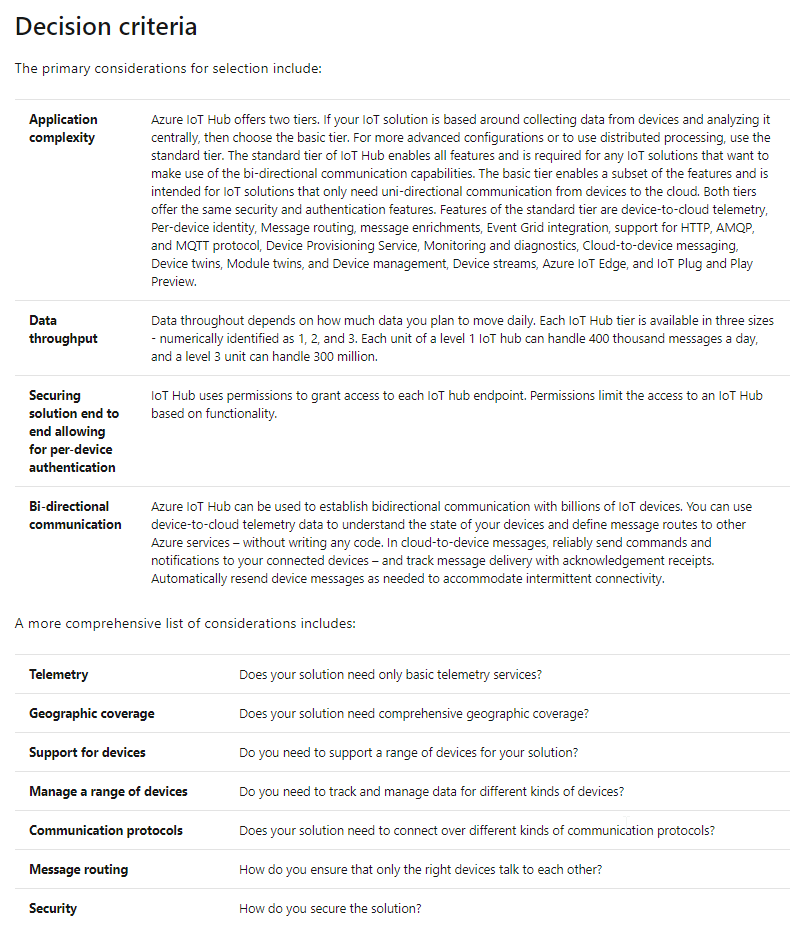

## Resources

* [IoT 101 Channel 9](https://channel9.msdn.com/Series/IoT-101/?WT.mc_id=EducationalIoT-c9-niner)

## Glossary

**Telemetry**: Telemetry is the process of recording and transmitting values received by an IoT device. Telemetry is an essential function of an IoT solution.

**Provisioning**: The act of provisioning a device to the cloud uniquely identifies the device to the cloud. Provisioning also establishes the security protocols for the device and its access rights and privileges.

**Routing**: Message routing enables you to send messages from your devices to cloud services in an automated, scalable, and reliable manner. You can send either device telemetry messages or events (for example device lifecycle events).

**Scaling**: For cloud solutions, scaling involves the need to ramp up or down the scope of the solution. The ability to scale a solution up or down gives the developer the flexibility to deploy different kinds of solutions.

**Service availability**: Service availability aims to ensure an agreed level of operational performance (typically uptime) for a cloud service. Service availability is defined by the service level agreement (SLA).

**IoT hub enables you to**:

**Secure your communications**: IoT Hub enables secure communications for your devices to send data providing per-device authentication with multiple authentication types.

**Scale your solution**: IoT Hub allows you to scale to millions of simultaneously connected devices and millions of events per second to support your IoT workloads. There are two considerations to determining how to scale your solution: the features you plan to use and the amount of data you plan to move daily.

Azure IoT Hub offers two tiers: the basic tier and the standard tier. To develop full-featured and bi-directional communication capabilities, you should use the standard tier. The basic tier provides a subset of features and is intended for solutions that only need uni-directional communication from devices to the cloud. Both basic and standard tiers offer the same security and authentication features.

Data throughput is the second consideration in determining how to scale your solution. Each IoT Hub tier is available in three sizes, numerically identified as 1, 2, and 3. Each unit of a level 1 IoT hub can handle 400 thousand messages a day, while a level 3 unit can handle 300 million.

**Route device data**: IoT Hub enables you to send messages based on automated rules to optimize data traffic.

**Send commands to devices**: IoT Hub can also send Cloud-to-device messages. Cloud-to-device messages enable you to send commands and notifications to your connected devices.

**Monitor your IoT solution's health**: IoT Hub allows tracking events such as device creation, device communication failures, and device connections.

**Integrate with other services**: You can seamlessly integrate IoT Hub with other Azure services to build an end-to-end solution. For example, you can incorporate IoT Hub with Azure Logic Apps and Event Grid to automate business processes.

**Manage and configure your devices**: Using IoT Hub, you can manage your connected devices at scale. You can set and query the device status and automatically respond to a change in state for devices.

**Create highly available and resilient solutions**: Create solutions, which are highly available as per a specified service level agreement and benefit from built-in failover capabilities.

**Connect virtually any devices**: Using Azure IoT open-source device SDKs, you can build solutions, which run on connected devices and interact with IoT Hub. You can also connect devices natively to the IoT Hub using protocols such as MQTT, HTTPS 1.1, or AMQP.

IoT Hub is a managed service, hosted in the cloud, that acts as a central message hub for bi-directional communication between your IoT solutions and the devices it manages.

## How IoT Hub works

**Protocols supported**: IoT Hub allows devices to use the following protocols for device-side communications: MQTT, MQTT over WebSockets, AMQP, AMQP over WebSockets and HTTPS

**Device Identity Registry**: IoT Hub maintains an identity registry. The identity registry stores information about the devices and modules permitted to connect to the IoT Hub. An identity registry entry for the device or module must exist before the entity can connect to the IoT Hub. A device or module must also authenticate with the IoT Hub based on credentials stored in the identity registry.

**Authentication**: Azure IoT Hub grants access to endpoints by verifying a token against the shared access policies and identity registry security credentials. You can use any X.509 certificate to authenticate a device with IoT Hub. Supported certificates include an existing X.509 certificate; CA-signed X.509 certificate; a self-generated and self-signed X-509 certificate.

**Device twins**: Device twins are JSON documents that store device state information, including metadata, configurations, and conditions. Azure IoT Hub maintains a device twin for each device that you connect to IoT Hub. Device twins store device-related information that Device and back ends can use to synchronize device conditions and configuration.

**Endpoints that IoT Hub exposes**: For each device in the identity registry, IoT Hub exposes a set of endpoints: Send device-to-cloud messages; Receive cloud-to-device messages; Initiate file uploads; Retrieve and update device twin properties; Receive direct method requests. IoT Hub currently supports the following Azure services as additional (custom) endpoints: Azure Storage containers, Event Hubs, Service Bus Queues, Service Bus Topics.

**Provisioning devices with Azure IoT Hub Device Provisioning Service**: The IoT Hub Device Provisioning Service is a helper service for IoT Hub. The device provisioning service enables zero-touch, just-in-time provisioning to the right IoT Hub without requiring human intervention, allowing the customers to provision millions of devices in a secure and scalable manner.

