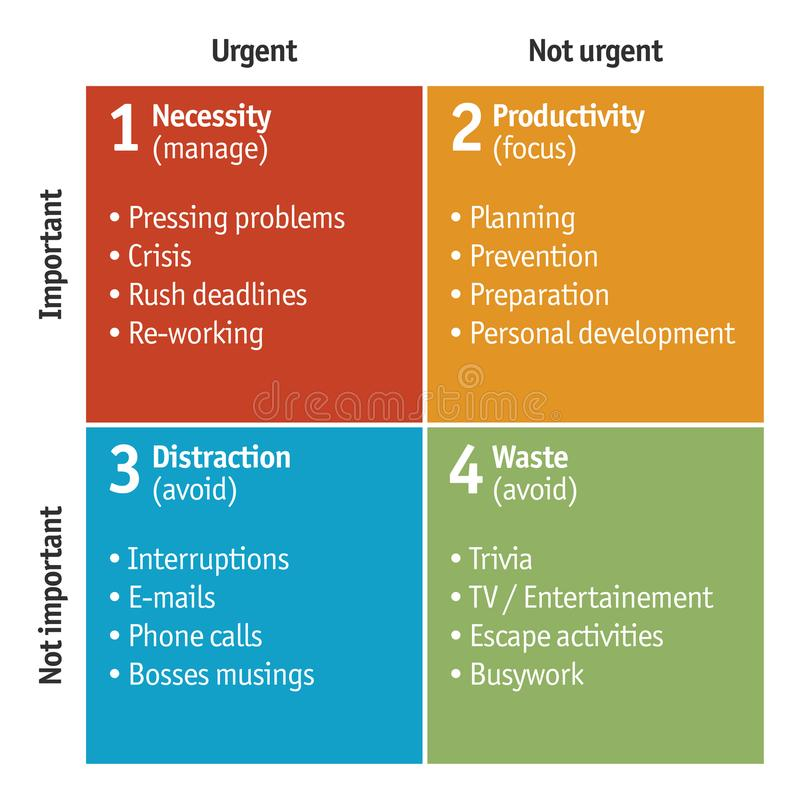

# Time management

Areas for balancing:
- Job
- Life
- Personal development

## Day planning

There will never be enough time to get everything done.
But there will always be enough time to get the most important things done.

The process is:
* List all tasks for the day
* Estimate task time and sequence by Priority/Importance
* Delegate some tasks

Priorities
* Pareto rule - 80% of tasks / 20% efforts
* Eisenhower matrix
* Common sense
* Don't mix up priorities and enthusiasm!

Effectiveness
* Achiving result
* Using the shortest way
* During the minimal possible time

### Eisenhower matrix

Decide: Do you have to do it yourself? If not - delegate!

If the price of your time is higher than the price of service - buy the service and "free your time".

Divide "what to do" and "when to do":
* Stiff tasks - connected to definite time
* Flexible tasks - can be done at any time
* Budgeted tasks - big tasks which need a long period of time to do

1. Time box
1. Put tasks on a special list -> make your head free

## Week/Month planning

* Set goals for every week (SMART goal)
  * 30-60 min to plan the week
* Plan your month
* Schedule time of absence

## SMART approach

* Specific
* Measurable
* Attainable
* Relevant
* Time-bound

## Instruments

* Calendar
* Outlook and OneNote
* ToDo lists:
  * Evernote
  * Wunderlist
  * Google keep
  * Trello

[Google Keep VS Wunderlist](https://www.guidingtech.com/google-keep-vs-wunderlist-comparison/),
[Google Keep VS Wunderlist VS Trello](https://www.slant.co/topics/1262/versus/~google-keep_vs_wunderlist_vs_trello)

## Pomodoro

Pomodoro
- 25 minutes of work
- Switch off from the outside world
- Work strictly on one task
- Mark when the task is completed

Break
- 5 minutes
- Go back to the outside world
- Every 4 pomodoros - 30 minutes break

Create the right environment and atmosphere!

ASMR room

Protect your time! Say, no!
Set the expectations.

## Time killers

* Messengers
* Social networks
* Coffe talks

## Inbox zen

1. Reduce inbox trash flow
    1. Configure spam filters (notifications, old subscriptions, etc.).
    1. Only strategic and important daily interests
1. Training the team
    1. Explain that you can only be added to recipients of messages that are directly related to you
    1. For urgent cases there is a phone
    1. Explain this principle to customers, friends, family
1. Inbox automatization
    1. Set up the filters so that with a quick glance at the Inbox you understand what needs your immediate attention, what you can see at the end of the day, and what - during the week.
1. Use deferred reading services
    1. Pocket
    1. Instapaper
1. Create to-do list using special services
1. Use "Two minutes" rule
    1. Immediately respond only to emails that take less than two minutes of your time
    1. Send the rest to the to-do list or to the Read Later folder.

