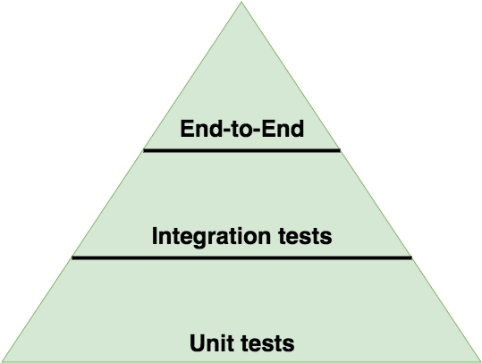

# Testing

**What should I test in my application? How many tests should I have?**

The answer varies across use-cases, but as a rule of thumb, you can follow the guidelines set by the **test pyramid**.

The test pyramid describes that you should write unit tests, integration tests and end-to-end tests as well.

You should have more integration tests than end-to-end tests, and even more unit tests.

## Unit tests

> You should write the test for the exposed methods, not for the internal workings of the given module.

### The Anatomy of a Unit Test

Each unit test has the following structure:

1. Test setup
1. Calling the tested method
1. Asserting

**Each unit test should test one concern only.**
_(this doesn't mean that you can add one assertion only)._

### Spies, Stubs, Mocks

### Code coverage

## Integration tests

Integration testing is logically an extension of unit testing. When two or more units are combined, they result into what is called interface. This interfaces are further combined to form components. Integration testing identifies problems that occur at the interface level. This method reduces the number of potential problems.

Integration testing helps to ensure that the functional, performance, and reliability between the units that are integrated are working properly.

## End-to-end tests

## Other types of testing

* Functional Testing
* System Testing
* Stress Testing
* Performance Testing
* Usability Testing
* Acceptance Testing